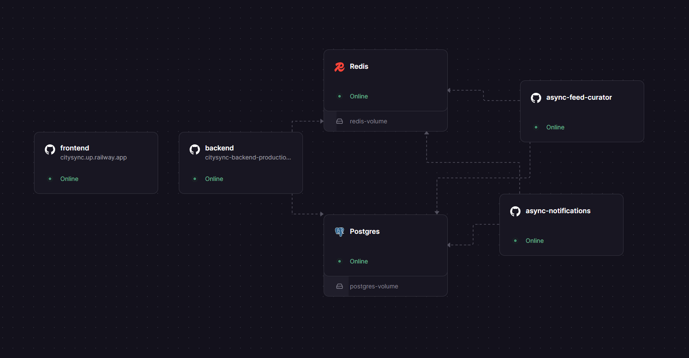

# CitySync

CitySync is a location-aware meetup platform built with a modern full-stack architecture. It combines a modular monolith backend and Redis-driven async workers to deliver responsive APIs and scalable event workflows.

## Tech Stack

### Frontend
- Next.js
- TypeScript
- Tailwind CSS
- OpenStreetMap (Nominatim)

### Backend
- Node.js
- Express
- TypeScript
- PostgreSQL
- Redis
- AWS S3 (presigned uploads)

### Infrastructure
- pnpm monorepo
- Redis workers
- Railway deployment

## Monorepo Structure

```text
.
|-- apps/
|   |-- frontend/
|   `-- backend/
|-- package.json
|-- pnpm-workspace.yaml
`-- README.md
```

## Production Environment


## Architecture

### Modular Monolith
- No module directly accesses another module's repository.
- Cross-module interaction is done via service interfaces.

### Backend Modules
- Auth
- User
- Meetups
- Participate
- Feed
- Notifications

This keeps strong domain boundaries without premature microservice complexity.

## Authentication and Security

- Proprietary JWT authentication (not OAuth)
- Access and refresh tokens in HTTP-only cookies
- Token rotation on refresh
- Redis-based rate-limiting middleware
- Centralized global error handler for consistent API responses

## Media Uploads

- Users and meetups support avatars/flyers
- Backend issues S3 presigned URLs
- Client uploads directly to S3
- Backend does not handle raw file payloads

## Asynchronous Processing with Redis

### Notifications
- API writes notification events to Redis and responds immediately
- Notification worker consumes events and persists notifications in PostgreSQL asynchronously

This avoids blocking API requests and isolates side effects.

### Feed Curation

Feed ranking uses:
- User latitude/longitude
- Participant count
- Start time

Performance behavior:
- Short-term feed caching (~1 minute) to reduce DB scans
- Feed worker periodically detects popular geographic areas
- Feed worker precomputes feed data to speed up requests

Fallback:
- If the worker is unavailable, feed generation falls back to on-demand scoring.

## Frontend Structure

Frontend domains mirror backend modules. Each domain contains:
- API layer
- Hooks
- Types
- Components

Location input is powered by OpenStreetMap Nominatim.

## Deployment

Deployed on Railway with separate services for:
- Backend API
- Redis
- PostgreSQL
- Feed worker
- Notification worker

Persistent volumes are used for Redis and PostgreSQL.

## Purpose

CitySync was built to explore:
- Modular backend design
- Asynchronous workflows with Redis
- Feed ranking and caching strategies
- Production-style deployment